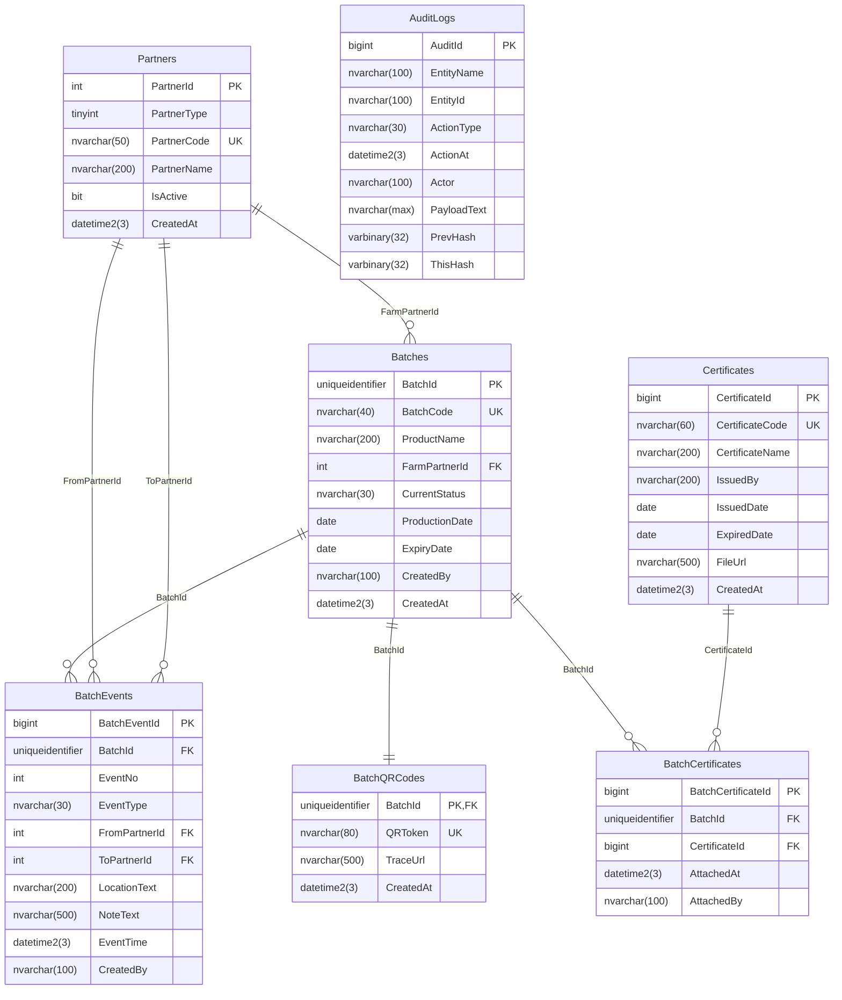

# BlueFoodSCM Database ERD and Data Dictionary

Generated from live SQL Server metadata on 2026-04-07.
Source: BAKHANG\\SQLEXPRESS, database BlueFoodSCM.

## ERD

## Business Rules and Integrity

- Append-only history:
  - `scm.BatchEvents` blocked from UPDATE/DELETE by trigger `TR_BatchEvents_BlockUpdateDelete`.
  - `scm.BatchCertificates` blocked from UPDATE/DELETE by trigger `TR_BatchCertificates_BlockUpdateDelete`.
  - `audit.AuditLogs` blocked from UPDATE/DELETE by trigger `TR_AuditLogs_BlockUpdateDelete`.
- Unique business keys:
  - `scm.Partners.PartnerCode`
  - `scm.Batches.BatchCode`
  - `scm.BatchQRCodes.QRToken`
  - `scm.Certificates.CertificateCode`
  - `scm.BatchEvents (BatchId, EventNo)`
  - `scm.BatchCertificates (BatchId, CertificateId)`

## Table Descriptions

### `scm.Partners`
Purpose: Master data of supply-chain actors (farm, transport, warehouse, store).

| Column | Type | Null | Key | Description |
|---|---|---|---|---|
| PartnerId | int | No | PK | Internal partner identifier. |
| PartnerType | tinyint | No |  | Partner category (farm/transport/warehouse/store). |
| PartnerCode | nvarchar(50) | No | UK | Business partner code. |
| PartnerName | nvarchar(200) | No |  | Display name. |
| IsActive | bit | No |  | Active flag. |
| CreatedAt | datetime2(3) | No |  | Created timestamp. |

### `scm.Batches`
Purpose: Core batch entity for traceability.

| Column | Type | Null | Key | Description |
|---|---|---|---|---|
| BatchId | uniqueidentifier | No | PK | Internal batch identifier (GUID). |
| BatchCode | nvarchar(40) | No | UK | Human-readable unique batch code. |
| ProductName | nvarchar(200) | No |  | Product label for the batch. |
| FarmPartnerId | int | Yes | FK | Producing farm partner. |
| CurrentStatus | nvarchar(30) | No |  | Latest status snapshot. |
| ProductionDate | date | Yes |  | Production date. |
| ExpiryDate | date | Yes |  | Expiration date. |
| CreatedBy | nvarchar(100) | No |  | User/account that created batch. |
| CreatedAt | datetime2(3) | No |  | Created timestamp. |

### `scm.BatchEvents`
Purpose: Immutable timeline events of each batch.

| Column | Type | Null | Key | Description |
|---|---|---|---|---|
| BatchEventId | bigint | No | PK | Event row identifier. |
| BatchId | uniqueidentifier | No | FK | Linked batch. |
| EventNo | int | No | UK(part) | Sequential event number per batch. |
| EventType | nvarchar(30) | No |  | Event action type (CREATED, SHIPPED, RECEIVED, etc). |
| FromPartnerId | int | Yes | FK | Source partner. |
| ToPartnerId | int | Yes | FK | Destination partner. |
| LocationText | nvarchar(200) | Yes |  | Free-text location. |
| NoteText | nvarchar(500) | Yes |  | Event note. |
| EventTime | datetime2(3) | No |  | Event timestamp. |
| CreatedBy | nvarchar(100) | No |  | Event actor. |

### `scm.BatchQRCodes`
Purpose: One QR identity and trace URL per batch.

| Column | Type | Null | Key | Description |
|---|---|---|---|---|
| BatchId | uniqueidentifier | No | PK, FK | Same batch id, one-to-one mapping. |
| QRToken | nvarchar(80) | No | UK | Unique token encoded in QR. |
| TraceUrl | nvarchar(500) | No |  | Public trace endpoint URL. |
| CreatedAt | datetime2(3) | No |  | Created timestamp. |

### `scm.Certificates`
Purpose: Certificate master records (e.g., VietGAP).

| Column | Type | Null | Key | Description |
|---|---|---|---|---|
| CertificateId | bigint | No | PK | Certificate row identifier. |
| CertificateCode | nvarchar(60) | No | UK | Business certificate code. |
| CertificateName | nvarchar(200) | No |  | Certificate display name. |
| IssuedBy | nvarchar(200) | Yes |  | Issuer organization. |
| IssuedDate | date | Yes |  | Issue date. |
| ExpiredDate | date | Yes |  | Expiration date. |
| FileUrl | nvarchar(500) | Yes |  | File storage URL. |
| CreatedAt | datetime2(3) | No |  | Created timestamp. |

### `scm.BatchCertificates`
Purpose: Immutable attachment of certificates to batches.

| Column | Type | Null | Key | Description |
|---|---|---|---|---|
| BatchCertificateId | bigint | No | PK | Attachment row identifier. |
| BatchId | uniqueidentifier | No | FK, UK(part) | Linked batch. |
| CertificateId | bigint | No | FK, UK(part) | Linked certificate. |
| AttachedAt | datetime2(3) | No |  | Attachment timestamp. |
| AttachedBy | nvarchar(100) | No |  | Actor who attached certificate. |

### `audit.AuditLogs`
Purpose: Append-only audit trail with hash-chain fields.

| Column | Type | Null | Key | Description |
|---|---|---|---|---|
| AuditId | bigint | No | PK | Audit row identifier. |
| EntityName | nvarchar(100) | No |  | Logical entity type (BATCH, BATCH_EVENT, etc). |
| EntityId | nvarchar(100) | No |  | Entity identifier in text form. |
| ActionType | nvarchar(30) | No |  | Audit action (INSERT, STATUS_CHANGE, ATTACH_CERT). |
| ActionAt | datetime2(3) | No |  | Action timestamp. |
| Actor | nvarchar(100) | No |  | User/account performing action. |
| PayloadText | nvarchar(max) | Yes |  | Serialized audit payload. |
| PrevHash | varbinary(32) | Yes |  | Previous hash in chain. |
| ThisHash | varbinary(32) | No |  | Current hash in chain. |

## View (Read Model)

### `scm.vw_BatchTrace`
Purpose: Denormalized read model for trace timeline by joining batches, events, partners, and QR data.
Main columns: `BatchCode`, `ProductName`, `CurrentStatus`, `QRToken`, `TraceUrl`, `EventNo`, `EventType`, `EventTime`, partner names, and event note/location.
